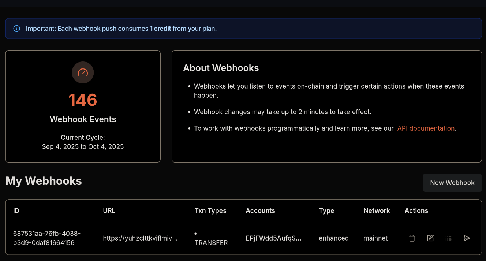
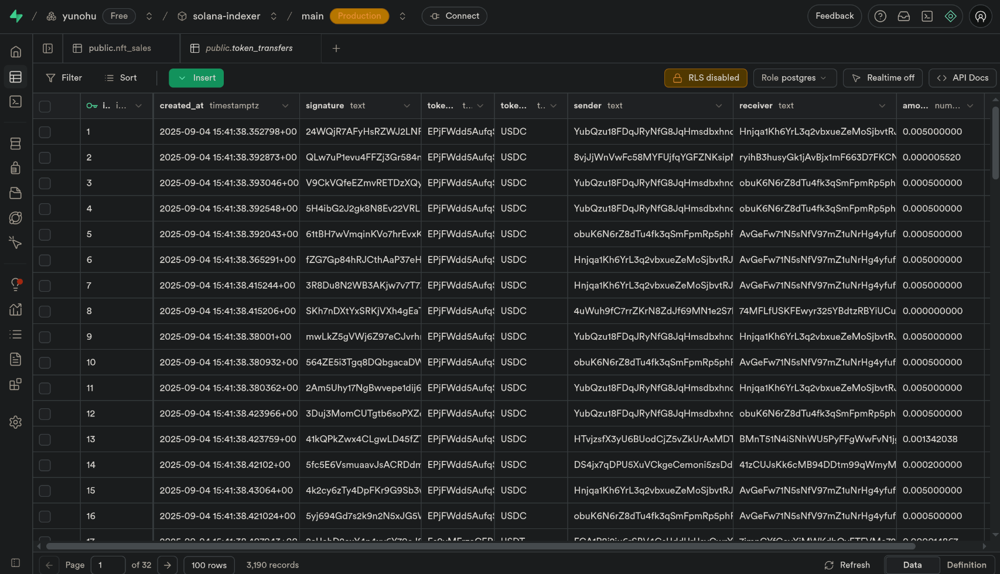
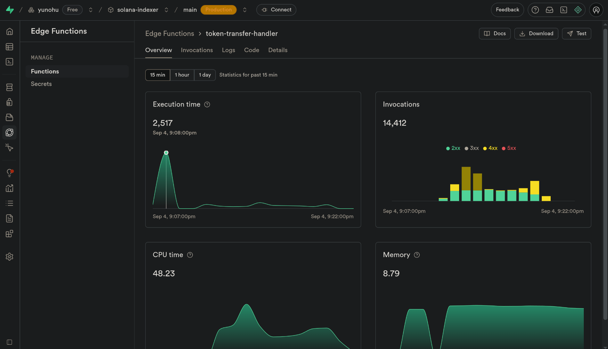

# Serverless Solana Indexer
I have tried to make 
a serverless indexer designed to track real-time events on the Solana blockchain. This project leverages Helius webhooks for live on-chain event data and Supabase Edge Functions for processing and storage.

## Features

- **Real-time:** Captures and stores token transfers seconds after they are confirmed on-chain.
- **Serverless:** Built entirely on managed infrastructure, requiring no server maintenance Easily configured to track anything , like It can handle the high throughput of tokens.
- **easy setup:** There's no complex client library or connection management, allowing you to go from idea to a working product in hours for example Rapid prototyping in hackathons where speed is critical
- **Perfect for Applications:** This can be used for rapidly building and testing new ideas. where the goal is to get clean data into a database to be served via an API.


## Tech Stack

- **Data Source:** [Helius](https://helius.dev) (Enhanced Webhooks)
- **Backend & Database:** [Supabase](https://supabase.com) (Edge Functions & PostgreSQL)
- **Language:** TypeScript (via Deno runtime)

## Architecture

The data pipeline is simple and efficient:

`Solana On-Chain Transfer` → `Helius Webhook` → `Supabase Edge Function` → `Supabase PostgreSQL DB`

---

## Getting Started

Follow these instructions to set up and deploy your own  solana indexer.
here we will implement for token transfers

### Prerequisites

1.  **Node.js & npm:** Install from [nodejs.org](https://nodejs.org).
2.  **Supabase Account:** Sign up for free at [supabase.com](https://supabase.com).
3.  **Helius Account:** Sign up for the free developer plan at [helius.dev](https://helius.dev).
4.  **Supabase CLI:** Install the command-line tool globally.
    refer this docs for more info
    https://supabase.com/docs/guides/local-development/cli/getting-started

### Step 1: Set Up the Supabase Project & Database

This creates the project and a dedicated table to store transfer data.

1.  **Create a New Supabase Project**

    - Go to your [Supabase Dashboard](https://app.supabase.com) and create a new project.
    - Give it a name, generate and save a secure password, and choose a region.

2.  **Create the Database Table**
    - Navigate to the **SQL Editor** in your Supabase project.
    - Run your required SQL query to create the table.

### Step 2: Configure the Helius Webhook

for example here we will
configure Helius to watch for USDC and USDT transfers.

1.  **Create a Webhook**
    - Go to your [Helius Dashboard](https://dev.helius.xyz/) and click **"Webhooks"**.
    - Click **"Create Webhook"**.
    - **Webhook URL:** Leave this blank for now (we'll add it in Step 6).
    - **Transaction Types:** Select `TRANSFER`.
    - **Webhook Type:** Select `ENHANCED`.
    - **Account Addresses:** Add the official mint addresses for the tokens you want to track.
      ```
      EPjFWdd5AufqSSqeM2qN1xzybapC8G4wEGGkZwyTDt1v  -- USDC
      Es9vMFrzaCERmJfrF4H2FYD4KCoNkY11McCe8BenwNYB  -- USDT
      ```
    - Click **"Create Webhook"**.

### Step 3: Set Up the Local Environment

Set up the project on your local machine.

1.  **Create and Initialize Project Folder**

    ```bash
    mkdir my-solana-token-indexer
    cd my-solana-token-indexer
    supabase init
    ```

2.  **Log In and Link Project**

    - Log in to the Supabase CLI: `supabase login`.
    - Link to your remote project. Get your `<YOUR_PROJECT_REF>` from **Project Settings > General** in your Supabase dashboard.
      ```bash
      supabase link --project-ref <YOUR_PROJECT_REF>
      ```

3.  **Create the Edge Function**
    ```bash
    supabase functions new <FUNCTION NAME>
    ```
    This creates the file `supabase/functions/<FUNCTION NAME>/index.ts`.

### Step 4: Write the Edge Function Code

This is the logic that parses transfer data from Helius and saves it.

- Open `supabase/functions/<FUNCTION NAME>/index.ts`

> dont worry about dino or import errors , after deploying supabase will take care of it . also no need to create any .env files .

### Step 5: Deploy the Edge Function

Make your function live and accessible via a public URL.

- Run the deploy command in your terminal:

```bash
    supabase functions deploy <FUNCTION NAME> --no-verify-jwt
```

- After deployment, copy the function's URL from the terminal output.

### Step 6: Connect Helius to Supabase

This is the final connection in our pipeline.

- Go back to your Helius webhook for tokens.

- Paste your copied function URL into the `Webhook URL`field.

- Click `Save Webhook`.



### Step 7: Verify It Works

Your indexer is now live!

- Go to your Supabase dashboard.

- Navigate to the Table Editor and select the `token_transfers` table.

- You should see new rows appearing very quickly as transfers occur on-chain. tadaa



## Deploying an Edge Function via the Supabase Browser

While the Supabase CLI is the recommended method for production workflows, you can also deploy a function for testing directly through the browser dashboard.

### Step 1: Navigate to Edge Functions

- In your Supabase project dashboard, click on the `Edge Functions` icon on the left-hand menu (it looks like a lightning bolt).

### Step 2: Deploy a New Function

- Click the `"deploy a new function"` button.
- Give your function a name, for example, `my-function`.
- select via editor .

### Step 3: Paste Your Code

- A code editor will appear in the browser. Delete all the default boilerplate code.
- Copy your complete function code from your `index.ts` file and paste it into this editor.

### Step 4: Save and Deploy

- Click the ` Deploy` button at the bottom right of the screen.
- Wait a minute for Supabase to build and deploy your function.

### Step 5: Get the URL and Set Verification

- After the deployment is successful, navigate back to the main page for your function.
- Under the **"Details"** section, you will find the function's **URL**. Copy this to use in your Helius webhook.
- **Crucially**, Change **"JWT Verification"** to **"No verification required."** This is necessary for external services like Helius to be able to call your function.

> **Note:** This browser-based method is excellent for quick tests and small edits. For managing a real project, especially as it grows, the CLI workflow is more robust and allows for local development and version control.

## ⚠️ Important Note on Volume

When tracking high-frequency events like token transfers, be aware that this can trigger your Edge Function thousands of times per hour. This may quickly consume the monthly limits of the Supabase and helius and is better suited for a paid plan in long-term production.


